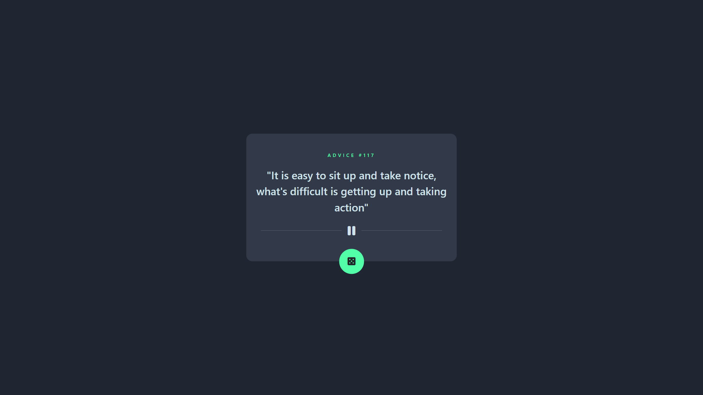
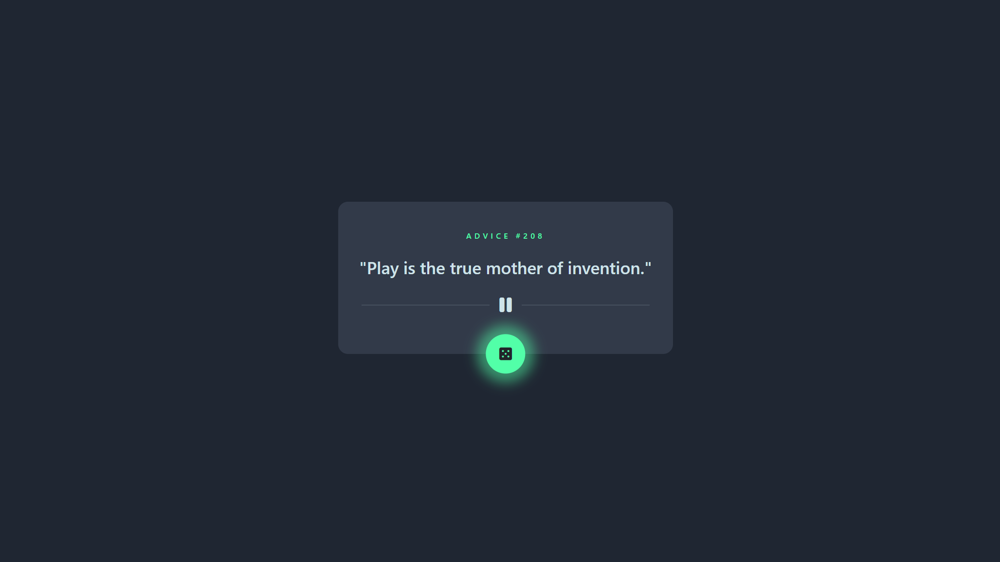
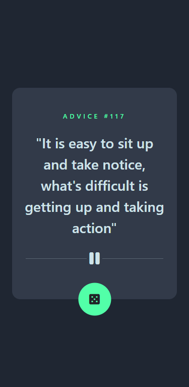
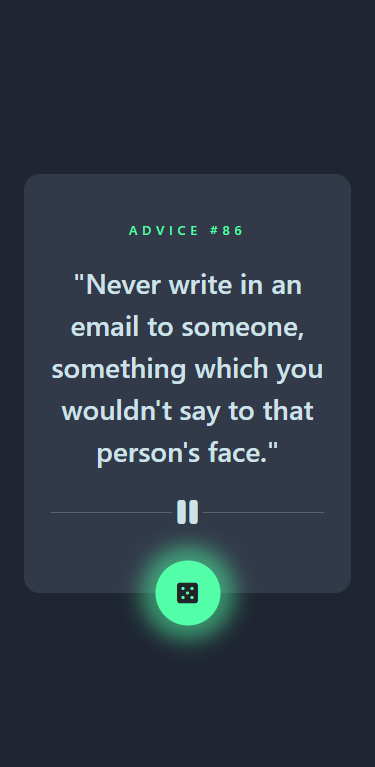

# Advice Generator Application

## Languages, Frameworks and Third Party Applications

-   
-   
-   
-   
-   
-   [Advice Slip API](https://api.adviceslip.com/#endpoint-id)

## Features

• By default page shows advice with the id of 117

• Button's hover state spins the dice and adds box-shadow

• Button is listened and with every click, Advice Slip API gets a request with an ID

• ID is created randomly between 0(inclusive)-500

•

## Screenshot

### Links

-   Solution URL: [Frontend Mentor | My Solution](https://www.frontendmentor.io/solutions/expenses-chart-component-html-css-sassscss-javascript-json-mCe50xYoZM)
-   Live Site URL: [Halibal | Advice Generator](https://github.com/halibal/advice-generator)

## Author

